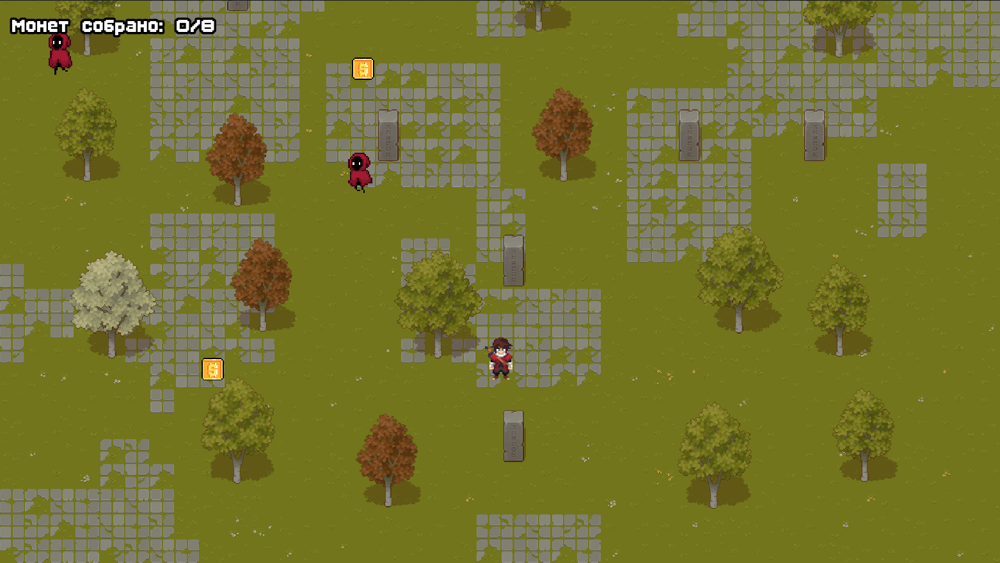

# Coin Grabber
Демонстрационный проект 2D-игры с видом сверху для десктопных платформ.

## Особенности реализации
### Требования
Версия Godot: 4.5.stable

### Управление
Управление интерфейсом и персонажем осуществляется исключительно клавиатурой. См. подсказки в меню игры.

### Карта
Генерация случайного ландшафта заброшенного сада. Размер карты — 50x50 тайлов.

### Поведение врагов
В начале новой игры враги активируются спустя 3 секунды, в продолженной — 1/2 секунды. Эта задержка помогает успеть среагировать. Сущности перемещаются случайным образом, а при сближении с игроком начинают преследовать его до тех пор, пока он не окажется на большом расстоянии, в связи с чем их скорость должна быть ниже скорости игрока для совершения отрыва.

### Конфигурация
Конфигурационный файл создаётся при первом запуске под именем "config.ini" в директории пользовательских данных. Данные считываются из него при каждом старте **новой** игры, соответственно на уже сохранённую игру он не влияет. Имеет следующие параметры с ограниченным диапазоном:
1. player_speed (скорость игрока от 0.0 до 300.0);
2. enemy_speed (скорость врагов от 0.0 до 300.0);
3. coin_count (количество монет от 1 до 16).

Путь к файлу отличается в зависимости от ОС:
* Windows: `%APPDATA%\Godot\app_userdata\coin-grabber-demo\config.ini`
* Linux: `~/.local/share/godot/app_userdata/coin-grabber-demo/config.ini`
* macOS: `~/Library/Application Support/Godot/app_userdata/coin-grabber-demo/config.ini`

Содержимое файла с наиболее играбельными значениями:

    [Main]

    player_speed=180.0
    enemy_speed=150.0
    coin_count=8

### Сохранение
Файл сохранения имеет название "level.dat" и располагается в той же папке, что и файл конфигурации. Учитываются следующие данные: количество собранных монет, позиции игрока и врагов, сгенерированный ландшафт, параметры из конфигурации, актуальные на момент начала игры. Сохранение происходит: после генерации карты, при взятии монеты, при возвращении в меню нажатием клавиши Escape. Прогресс стирается в случае победы или поражения.

## Техническое задание

### Задание 
Создать простую 2D-игру на движке Godot (Версия GDScript) , в которой игрок управляет персонажем, собирающим монеты на случайно сгенерированной карте. Цель игры — собрать все монеты, избегая столкновения с врагами, которые перемещаются по карте. Игра может выглядеть так, как вам больше нравится/проще реализовать задание - это может быть top down view или платформер вид сбоку, или другой вариант, все на ваше усмотрение. 

### Требования
1. Генерация карты:
    * Создать процедурно сгенерированную карту из тайлов. Карта должна состоять из проходимых и непроходимых тайлов (например, стены и земля).
    * Размер карты должен быть не менее 20x20 тайлов.
    * Для генерации можно использовать шум Перлина или другой алгоритм на усмотрение разработчика.
2. Игровой персонаж:
    * Игрок должен управлять персонажем с помощью клавиш (например, стрелок или WASD).
    * Персонаж должен плавно перемещаться по карте и сталкиваться с непроходимыми тайлами (стенами).
    * Персонаж должен уметь прыгать
        * Это может быть Dash
        * Это может быть преодоление препятствия
3. Враги:
    * В игре должно быть несколько врагов, которые случайно перемещаются по карте.
    * Враги должны уметь избегать непроходимых тайлов и следовать по доступным путям.
    * Столкновение с врагом должно завершать игру (например, показом сообщения «Game Over»).
4. Сбор монет:
    * На карте должно быть случайно размещено несколько монет.
    * При сборе монеты персонажем она исчезает, а счет игрока увеличивается.
    * Когда все монеты собраны, игроку показывается сообщение о победе.
5. Конфигурации:
    * Проект должен содержать в себе возможность редактировать конфигурации в одном \ нескольких файлах: Скорость передвижения врагов, параметры игрока,условия “Победы” - кол-во собранных монет
6. Интерфейс:
    * На экране должен отображаться счетчик собранных монет.
    * Добавить кнопки «Начать заново» и «Выйти» после завершения игры (победа или поражение).
7. Сохранение прогресса:
    * Реализовать возможность сохранения и загрузки прогресса игры, включая положение игрока, врагов и оставшихся монет.
8. Качество кода:
    * Код должен быть хорошо структурирован, с комментариями, объясняющими ключевые моменты.
    * Применение сигнально-слотовой системы Godot для взаимодействия между объектами будет преимуществом.

### Ожидаемый результат
Завершенная игра с перечисленными выше функциями, предоставленная в виде готового проекта Godot. Проект должен быть легко запускаемым и включать инструкции по управлению.

### Критерии оценивания
* Функциональность: Полное соответствие требованиям задания, использование многочисленных возможностей движка.
* Качество кода: Чистота, структурированность, комментарии.
* Оптимизация: Эффективность кода, работа с производительностью.
* Креативность: Подходы к реализации генерации карты, поведение врагов и общий игровой дизайн.
